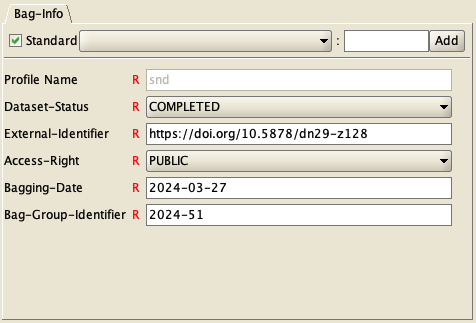

# Swedish National Data Service Bagger profile


This is the Swedish National Data Service profile for
[Bagger](https://github.com/LibraryOfCongress/bagger), a Java GUI application
for creating packages of data files and manifests according to the BagIt specification,
[RFC 8493](https://datatracker.ietf.org/doc/html/rfc8493).

## Introduction
The [Swedish National Data Service](https://snd.se) uses the BagIt File Packaging Format (RFC 8493) for packaging versioned datasets [published in the SND data repository](https://www.snd.se/en/describe-and-share-data).

This profile ensures compliance with metadata requirements for the SND infrastructure, and should be used to package every version of a dataset.

Using the Bagger profile is also the recommended packaging solution for collaborating organisations who wishes to publish data using the SND data repository, but need to store data locally for legal or practical reasons.

If you are using other tools than Bagger to create BagIt packages you may of course create the fields in a compliant way using other methods.

## Installation
* Make sure that you have installed Bagger along with a required Java runtime environment. More information is available at: https://github.com/LibraryOfCongress/bagger
* Download _snd-profile.json_ from a release or using the Download Raw File button on GitHub.
* Move _snd-profile.json_ to the _bagger_ directory. This directory will be created the first time you start Bagger, so start it once if you have not already done so.
    - On Windows, the default location of the _bagger_folder is:
```C:\Users\<username>\bagger```
    - On older versions of Windows, the default location is: 
```C:\Documents and Settings\<username>\bagger```
    - On macOS or Linux, the default location is: ```~/bagger``` which means f.e. ```/Users/<username>/bagger``` on macOS or ```/home/<username>/bagger``` on most Linux distributions.
    - You may also change the location where bagger looks for profile files by changing the path in the global environment variable ```BAGGER_PROFILES_HOME```.
* After starting up Bagger, you should now be able to select "snd" as a profile when creating a new bag, and the required metadata fields should be available for editing.

## How to fill in the metadata

**Access-Right**

This field should be ```PUBLIC``` if the dataset is freely accessible (open access) data, and ```NON_PUBLIC``` if it is published with restricted access. This follows the [EU Access right vocabulary](https://op.europa.eu/en/web/eu-vocabularies/concept-scheme/-/resource?uri=http://publications.europa.eu/resource/authority/access-right) and the two codes:

http://publications.europa.eu/resource/authority/access-right/PUBLIC  
http://publications.europa.eu/resource/authority/access-right/NON_PUBLIC  

Example: ```PUBLIC```

**Bagging-Date**

The date when the bag was packaged in [ISO 8601](https://www.iso.org/iso-8601-date-and-time-format.html) YYYY-MM-DD data format.

Example: ```2024-03-27```

**Bag-Group-Identifier**

The SND dataset ID, connecting the packaged dataset to the logical data publication in the SND data repository and catalogue, along with the associated metadata context for the dataset.

Example: ```2024-51```

**Dataset-Status**

When you have packaged a dataset version with the SND Bagger profile, the version is considered ```COMPLETED```. It may still be unpublished. In some cases, datasets need to be ```WITHDRAWN```. This may be because contents were published by mistake, or because the dataset is scheduled for deletion after a decision made during archival appraisal. This follows the [EU Dataset status vocabulary](https://op.europa.eu/en/web/eu-vocabularies/dataset/-/resource?uri=http://publications.europa.eu/resource/dataset/dataset-status) and the two codes:

http://publications.europa.eu/resource/authority/dataset-status/COMPLETED  
http://publications.europa.eu/resource/authority/dataset-status/WITHDRAWN  

Example: ```COMPLETED```

**External-Identifier**

The persistent identifier reserved for, or assigned to, the dataset version that is packaged in the bag. This is usually a DOI. The PID should be in the form of a fully resolvable URL.

Example: ```https://doi.org/10.5878/dn29-z128```

## Screenshot

